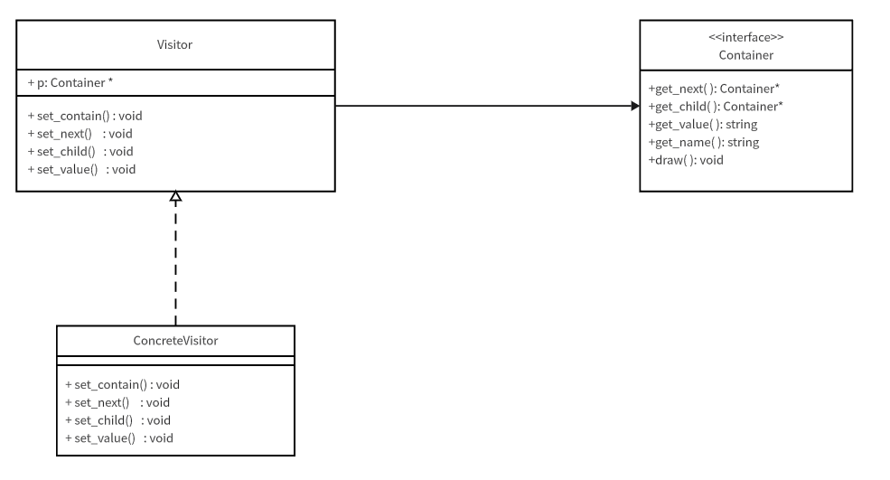
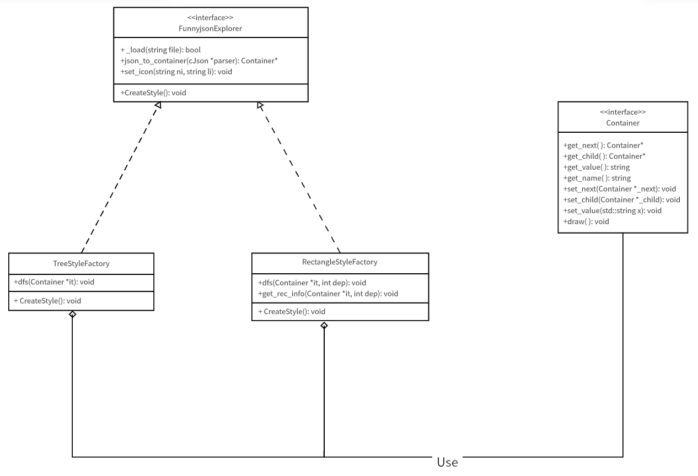
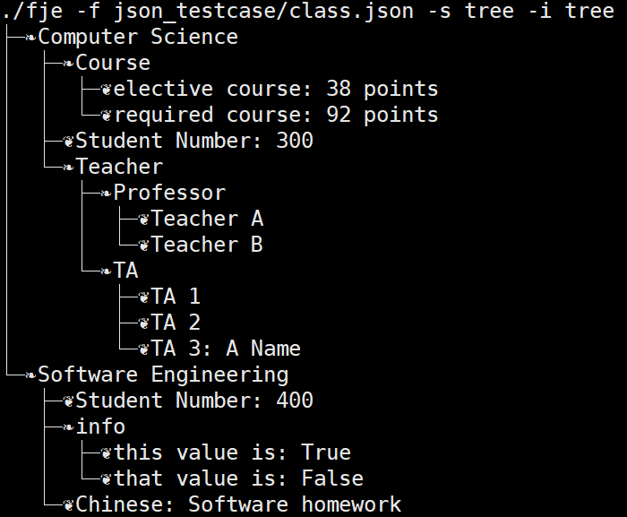
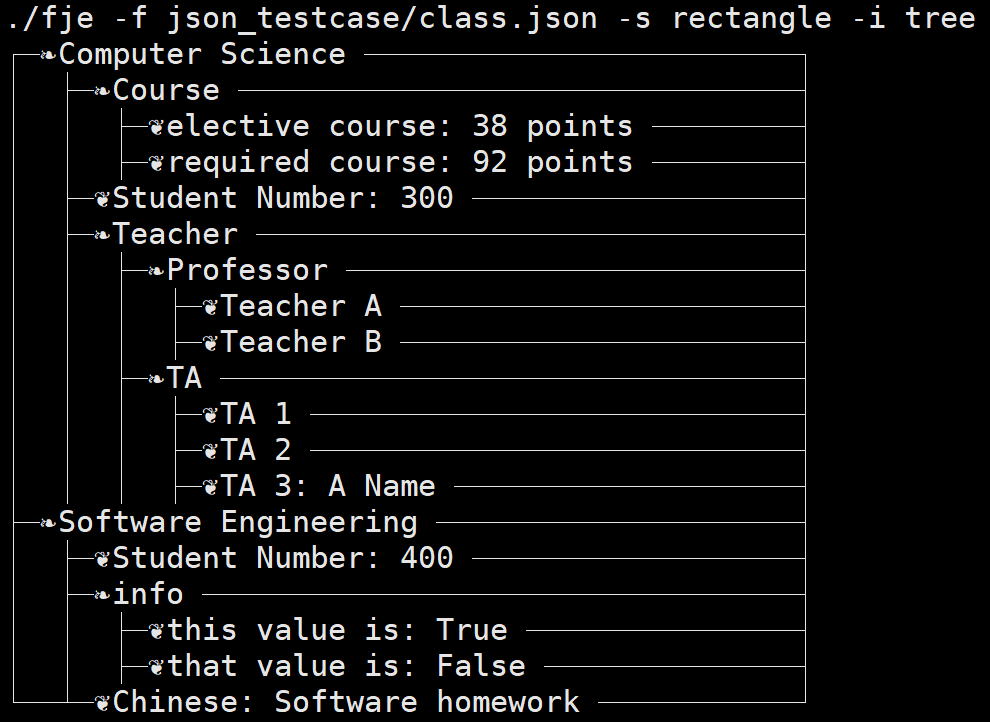
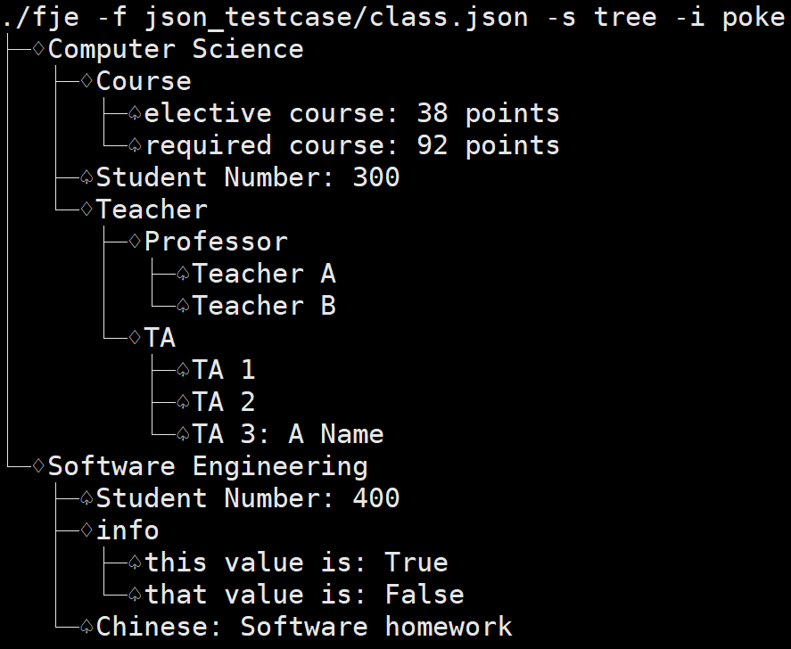
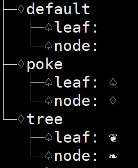

# Funny Json Explorer
软件工程作业

## 作业要求
- [x] (必做) 不改变现有代码，只需添加新的抽象工厂，即可添加新的风格 
- 已完成，在FunnyjsonExplorer中添加新的工厂类即可添加新风格。

- [x] (选做) 通过配置文件，可添加新的图标族
- 已完成，通过修改icon.json可配置新的图标族。

## 迭代器+访问者模式
**迭代器模式** 是一种行为型设计模式，主要用于提供一种方法顺序访问一个聚合对象（如列表、树、集合）中的各个元素，而不暴露其内部的表示。

Container.h 中定义 `Container` 类作为存储读取的json文件的数据结构，使用 `get_next()` 获取迭代器的下一个元素，实现json结构的遍历，`get_next()` 返回为NULL表示遍历结束。

举例来说，如果想要遍历完成整个json文件，可以使用如下方法：
```cpp
    for (Container iterator = json_tree; iterator != NULL; iterator = iterator.get_next()){
        //do something here
    }
```


**访问者模式** 是一种行为型设计模式，它将数据结构与对数据结构的操作分离，使得我们可以在不改变数据结构的前提下定义新的操作。这种模式特别适用于需要对对象结构中的各个元素进行不同的、不相关的操作的情况。

`Container.h` 中定义访问者类 `Visitor` 用于访问数据类 `Container`。




## 设计模式
工厂方法是一种常用的设计模式，它属于创建型模式，旨在提供一种将对象的实例化过程推迟到子类的方法。工厂方法模式通过定义一个创建对象的接口，但是将具体的实例化延迟到子类中来完成。

抽象工厂模式是一种创建型设计模式，它提供了一种方式来封装一系列相互关联或相互依赖的对象创建，而无需指定它们具体的类。抽象工厂模式允许系统独立于具体的产品类来指定产品的创建，它包含多个工厂方法，每个工厂方法负责创建一系列产品中的一个对象。

在本项目中实现了抽象工厂FunnyjsonExplorer，具体工厂TreeStyleFactory和RectangleStyleFactory。



顶层的抽象工厂FunnyjsonExplorer负责读取json文件，并转为Container链表。

特别的，具体工厂TreeStyleFactory和RectangleStyleFactory的产品为空，但是创建产品的过程函数会在控制台输出json的可视化图像。

各个函数的作用：
```
_load()            : 读取json文件
json_to_container(): 将读取的json结果转为Container类格式的链表
set_icon()         : 设置图标族
CreateStyle()      : 生成风格
```

## 可扩展性
如果需要添加新的风格，只需要在FunnyjsonExplorer中添加新的具体工厂，完善生产新风格的函数CreateStyle即可。

## 如何编译&运行
使用makefile中的命令编译、测试本项目
```
make build   # 编译项目生成可执行文件fje
make run     # 测试样例
make all     # 编译并测试
```

fje使用方法:
```
Usage        : fje -f <json file> [-s <style>] [-i <icon family>] [-h | -help]
<style>      : 1. tree
               2. rectangle
<icon family>: icon family name in file icon.json, use default icon family if empty.
[-h | -help] : see how to use fje.    
```

对于windows系统，也提供了已经编译好了的exe文件fje.exe，使用方法略有不同
```
Usage        : fje -f <json file> [-s <style>] [-i <icon family>] [-h | -help]
<style>      : 1. tree
               2. rectangle
<icon family>: two characters for inside node and leaf node
[-h | -help] : see how to use fje.
```

## 配置图像族
fje同文件夹下创建文件icon.json，通过修改json文件配置新的图像族，本项目文件夹下初始配置有icon.json，格式如下：
```
{
    "default" : {
        "leaf" : " ",
        "node" : " "
    },
    "poke" : {
        "leaf" : "♤",
        "node" : "♢"
    },
    "tree" : {
        "leaf" : "❦",
        "node" : "❧"
    }
}
```
其中 `default` 是默认的图像族，如果运行fje时不指定图像族则默认调用 `default` ，此处default设置为空白字符。

## 运行测试
json_testcase文件夹下存放有测试样例class.json以及fruit.json用于测试。

测试 （树形风格 or 矩形风格） X （树图标族 or 扑克图标族） 四种结果。

`style: tree` 
`icons: tree`


`style: rectangle` 
`icons: tree`


`style: tree` 
`icons: poke`


`style: rectangle` 
`icons: poke`


或者可以测试一下用自己读取自己的配置文件icon.json



## 第三方库
对json文件的读取通过第三方库cJSON的函数完成，将json文件的读取结果转为链表形式存储在Container类中。

生产风格的具体工厂通过遍历链表完成不同风格的命令行json图像生成。

cJSON的github链接: https://github.com/DaveGamble/cJSON